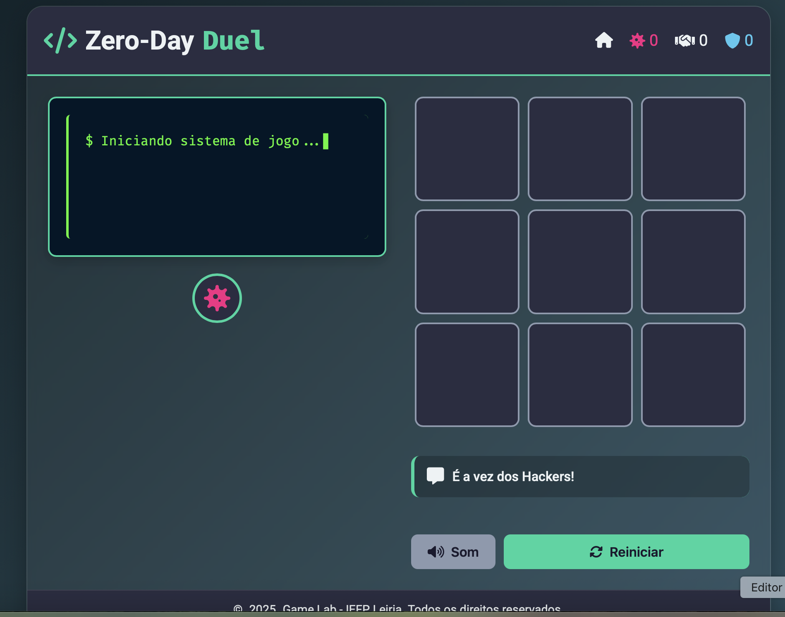

# 💻 Projeto Zero Day Duel | Jogo do Galo

Este projeto foi desenvolvido para demonstrar habilidades de programação e desenvolvimento web por meio de um clássico e estratégico **jogo do galo**, aqui reimaginado com o nome **Zero Day Duel**.

O **Zero Day Duel** é uma versão digital do tradicional jogo do galo (também conhecido como jogo da velha), onde dois jogadores competem para formar uma linha com três símbolos iguais em um tabuleiro 3x3, utilizando estratégias para vencer ou bloquear o adversário.

## 🎯 Objetivo

O principal objetivo deste projeto foi aplicar conhecimentos técnicos criando uma aplicação web interativa que utiliza as seguintes tecnologias:

- 🌐 **HTML** – Estrutura da página
- 🎨 **CSS** – Estilos e design visual
- ⚙️ **JavaScript** – Lógica do jogo e interatividade

## 📁 Estrutura do Projeto

```plaintext
📂 zero_day_duel
├── index.html 🔹 Estrutura da interface
├── script.js 🔸 Lógica e interatividade do jogo
└── style.css 🔸 Estilos e design visual
```
## 🧠 O que vais encontrar

- Interface simples e intuitiva para jogar o Zero Day Duel
- Jogo para dois jogadores, com alternância de turnos
- Validação das jogadas para detectar vitória, empate ou jogada inválida
- Feedback visual para as jogadas e resultado do jogo
- Possibilidade de reiniciar o jogo a qualquer momento

## 🎮 Demo

<p align="center">
  
</p>

*Acesso:* [Exploit Pattern Demo](https://lenicesoaares.github.io/zero-day-duel_game/)

📍 Este projeto foi apresentado na **Feira de Leiria**, com o propósito de mostrar o talento e as competências dos alunos do curso de **Técnico Especialista de Tecnologias e Programação de Sistemas de Informação**. Foi uma oportunidade incrível para partilhar conhecimento com o público e com outros colegas da área! 🙌

## 📜 Tecnologias Utilizadas

- **HTML5** para estruturação da página
- **CSS3** para estilização e layout responsivo
- **JavaScript** para controle da lógica do jogo, alternância de turnos e detecção de vitória

## 💾 Funcionalidades

- Alternância automática entre os jogadores X e O
- Verificação de vitória ou empate após cada jogada
- Mensagens de status indicando o jogador da vez, vitória ou empate
- Botão para reiniciar o jogo a qualquer momento

## 👤 Créditos

Trabalho realizado por:
- [Lenice Soares](https://github.com/lenicesoaares)
- [Juliana Alves](https://github.com/JulyDuds)
- [Babi Sobrinho](https://github.com/babisobrinho)
- [Rebeca Santos](https://github.com/RebecaSantosb)
- [Aline Armando](https://github.com/kiamy6)
- [Thalyson Santos](https://github.com/taysoic)

📚 IEFP Leiria
🛠️ Desenvolvido com dedicação, criatividade e paixão pela tecnologia! ❤️‍🔥


